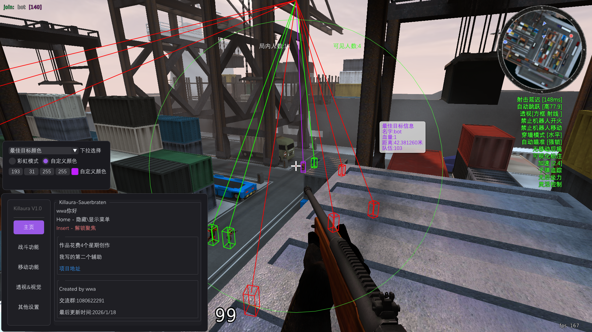
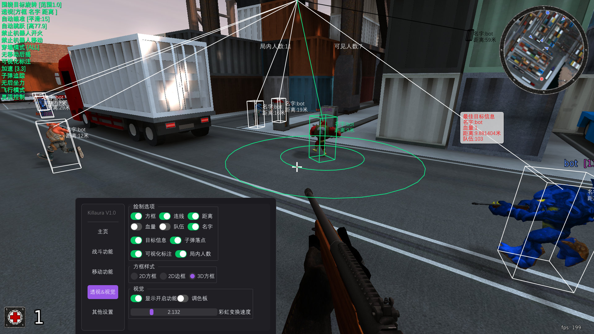
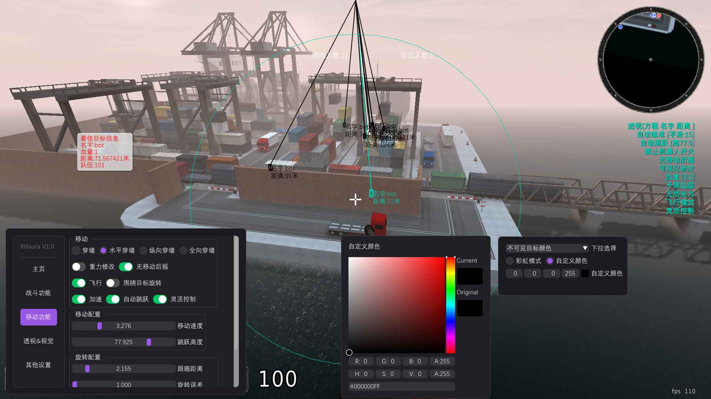

# Sauerbraten Internal Cheat (ImGui)

  

---

## 📸 预览 / Preview

### 菜单界面 (Menu Interface)

### 实战效果 (In-Game Visuals)

### 颜色编辑 (Color Editing)

---

## 📖 简介 (Introduction)

**Sauerbraten-Cheat** 是一个针对开源 FPS 游戏 *Cube 2: Sauerbraten* 的内部辅助（Internal Cheat）。
本项目基于 **C++** 编写，使用 **MinHook** 进行钩子拦截，并集成了 **ImGui** 绘制现代化的用户界面。

这是我的开源练习项目，旨在学习游戏逆向工程、OpenGL 绘制以及内存操作。

**Sauerbraten-Cheat** is an internal cheat for the open-source FPS game *Cube 2: Sauerbraten*.
Written in **C++**, it utilizes **MinHook** for function hooking and implements **ImGui** for a modern, responsive user interface.

This project serves as an educational resource for learning game reverse engineering, graphics rendering hooks, and memory manipulation.

---

## ✨ 功能 (Features)

### 🎯 战斗 (Combat)
* **Aimbot (自瞄)**: 自动锁定敌人头部或身体。
* **MagicBullet (魔术子弹)**: 修改子弹落点。
* **No Recoil (无后座)**: 移除武器后座力。

### 👁️ 视觉 (Visuals / ESP)
* **Box ESP (方框透视)**: 2D/3D 方框显示敌人位置。
* **Snaplines (射线)**: 绘制从屏幕中心到敌人的连线。
* **Health Bar (血条)**: 动态显示敌人生命值。
* **Name Tags (名字显示)**.

### ⚙️ 杂项 (Misc)
* **ImGui Menu**: 按下 `INSERT` 键呼出/隐藏菜单。
* **Config System**: 自动保存/加载配置。

---

## 🛠️ 如何编译 (How to Build)

### 前置要求 (Prerequisites)
* **IDE**: Visual Studio 2022 (推荐)
* **SDK**: Windows SDK
* **Libs**: 项目已包含必要的依赖库 (MinHook, ImGui, etc.)

### 步骤 (Steps)
1.  克隆本仓库。
2.  使用 Visual Studio 2022 打开 `killaura.sln`。
3.  将解决方案配置切换为 **`Release | x64`** 。
4.  按下 `Ctrl + Shift + B` 生成解决方案。
5.  生成的 DLL 文件将位于 `x64/Release` 目录下。

---

## 🚀 如何使用 (How to Use)

1.  启动游戏 *Cube 2: Sauerbraten*。
2.  使用任意 DLL 注入器 (如 Process Hacker, Xenos 等)。
3.  将编译好的 DLL 注入到 `sauerbraten.exe` 进程中。
4.  在游戏中按下 **`HOME`** 键打开菜单。

---

## ⚠️ 免责声明 (Disclaimer)

本项目仅供**教育和学习研究**使用。
* 请勿在多人联机服务器中使用此软件破坏他人体验。
* 开发者不对使用此代码造成的任何封号或法律后果负责。

This project is for **EDUCATIONAL and RESEARCH purposes only**.
* Do not use this software in multiplayer servers to ruin the game for others.
* The developer is not responsible for any bans or legal consequences resulting from the use of this code.

---

## 🙏 鸣谢 (Credits)

本项目离不开以下优秀的开源项目支持：
Special thanks to these amazing open-source projects:

* **[MinHook](https://github.com/TsudaKageyu/minhook)** by TsudaKageyu
    * The minimalist x86/x64 API hooking library for Windows.
    * 用于实现核心的钩子拦截功能 (Hooking)。

* **[Dear ImGui](https://github.com/ocornut/imgui)** by ocornut
    * Bloat-free Graphical User Interface for C++ with minimal dependencies.
    * 用于构建轻量级、高性能的作弊菜单界面。

* **[nlohmann/json](https://github.com/nlohmann/json)** by nlohmann
    * JSON for Modern C++.
    * 用于实现配置文件的序列化与反序列化 (Config System)。